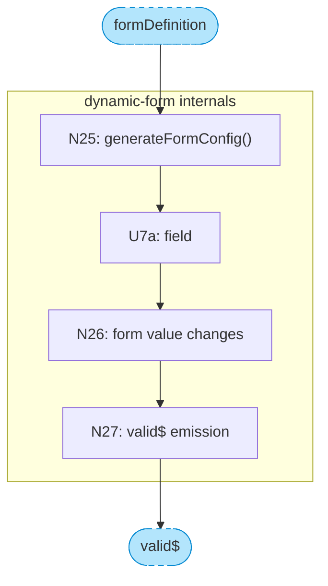

# Chunking

> Reference for the breadboarding skill. Consult this when a breadboard section has a single entry, single exit, and many internals you want to collapse into one node.

Chunking collapses a subsystem into a single node in the main diagram, with details shown separately. Use chunking to manage complexity when a section of the breadboard has:

- **One wire in** (single entry point)
- **One wire out** (single output)
- **Lots of internals** between them

### When to Chunk

Look for sections where tracing the wiring reveals a "pinch point" — many affordances that funnel through a single input and single output. These are natural boundaries for chunking.

Example: A `dynamic-form` component receives a form definition, renders many fields (U7a-U7k), validates on change (N26), and emits a single `valid$` signal. In the main diagram, this becomes:

```
N24 -->|formDefinition| dynamicForm
dynamicForm -.->|valid$| U8
```

### How to Chunk

1. **In the main diagram**, replace the subsystem with a single stadium-shaped node:

```
dynamicForm[["CHUNK: dynamic-form"]]
```

2. **Wire to/from the chunk** using the boundary signals:

```
N24 -->|formDefinition| dynamicForm
dynamicForm -.->|valid$| U8
```

3. **Create a separate chunk diagram** showing the internals with boundary markers:



4. **Style chunks distinctly** in the main diagram:

```
classDef chunk fill:#b3e5fc,stroke:#0288d1,color:#000,stroke-width:2px
class dynamicForm chunk
```

### Chunk Color Convention

| Type | Color | Hex |
|------|-------|-----|
| Chunk node (main diagram) | Light blue | `#b3e5fc` |
| Boundary markers (chunk diagram) | Light blue, dashed | `#b3e5fc` with `stroke-dasharray:5 5` |

### Benefits

- **Main diagram stays readable** — complex subsystems become single nodes
- **Detail preserved** — chunk diagrams show the internals when needed
- **Natural boundaries** — chunks often map to reusable components

