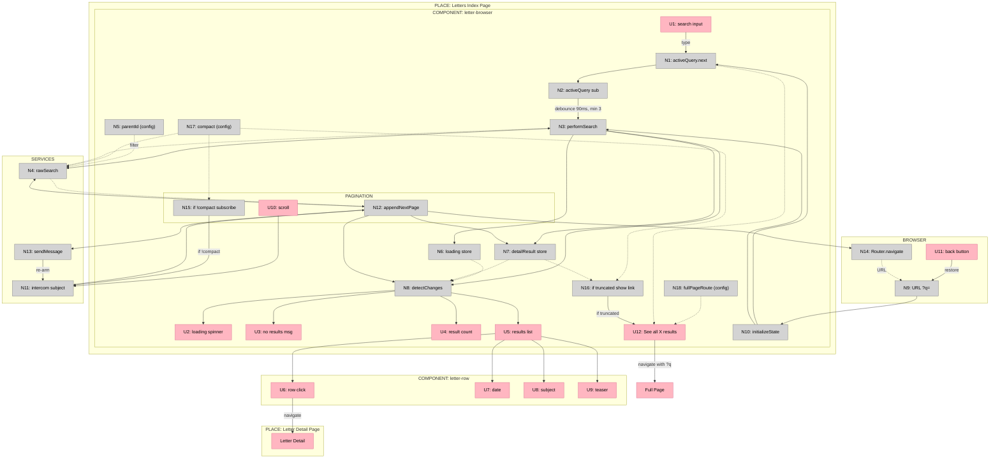

## Example B: Designing from Shaped Parts

A worked breadboarding example that takes a shaped solution (requirements, reusable patterns, and sketched parts) and details it out into concrete UI and Code affordances with explicit wiring.

Worked reference for the breadboarding skill. See SKILL.md for the canonical
table format and concepts.

---

### Part 1: Shaping Context (Input to Breadboarding)

This section shows what comes FROM shaping — the requirements, existing patterns identified, and sketched parts. This is the INPUT that breadboarding receives.

> **Note:** This example uses shaping terminology. In shaping, you define requirements (Rs), identify existing patterns to reuse, and sketch a solution as parts/mechanisms. Breadboarding takes this shaped solution and details out the concrete affordances and wiring.

**The R (Requirements)**

| ID | Requirement |
|----|-------------|
| R0 | Make content searchable from the index page |
| R2 | Navigate back to pagination state when returning from detail |
| R3 | Navigate back to search state when returning from detail |
| R4 | Search/pagination state survives page refresh |
| R5 | Browser back button restores previous search/pagination state |
| R9 | Search should debounce input (not fire on every keystroke) |
| R10 | Search should require minimum 3 characters |
| R11 | Loading and empty states should provide user feedback |

**Existing System with Reusable Patterns (S-CUR)**

The app already has a global search page that implements most of these Rs. During shaping, it was documented at the parts/mechanism level:

| Part | Mechanism |
|------|-----------|
| **S-CUR1** | **URL state & initialization** |
| S-CUR1.1 | Router queryParams observable provides `{q, category}` |
| S-CUR1.2 | `initializeState(params)` sets query and category from URL |
| S-CUR1.3 | On page load, triggers initial search from URL state |
| **S-CUR2** | **Search input** |
| S-CUR2.1 | Search input binds to `activeQuery` BehaviorSubject |
| S-CUR2.2 | `activeQuery` subscription with 90ms debounce |
| S-CUR2.3 | Min 3 chars triggers `performNewSearch()` |
| **S-CUR3** | **Data fetching** |
| S-CUR3.1 | `performNewSearch()` sets loading state, calls search service |
| S-CUR3.2 | Search service builds Typesense filter, calls `rawSearch()` |
| S-CUR3.3 | `rawSearch()` queries Typesense, returns `{found, hits}` |
| S-CUR3.4 | Results written to `detailResult` data store |
| **S-CUR4** | **Pagination** |
| S-CUR4.1 | Scroll-to-bottom triggers `appendNextPage()` via intercomService |
| S-CUR4.2 | `appendNextPage()` increments page, calls search |
| S-CUR4.3 | New hits concatenated to existing hits |
| S-CUR4.4 | `sendMessage()` re-arms scroll detection |
| **S-CUR5** | **Rendering** |
| S-CUR5.1 | `cdr.detectChanges()` triggers template re-evaluation |
| S-CUR5.2 | Loading spinner, "no results", result count based on store |
| S-CUR5.3 | `*ngFor` renders tiles for each hit |
| S-CUR5.4 | Tile click navigates to detail page |

**Sketched Solution: Parts that Adapt S-CUR**

The new solution's parts explicitly reference which S-CUR patterns they adapt:

| Part | Mechanism | Adapts |
|------|-----------|--------|
| F1 | Create widget (component, def, register) | — |
| F2 | URL state & initialization (read `?q=`, restore on load) | S-CUR1 |
| F3 | Search input (debounce, min 3 chars, triggers search) | S-CUR2 |
| F4 | Data fetching (`rawSearch()` with filter) | S-CUR3 |
| F5 | Pagination (scroll-to-bottom, append pages, re-arm) | S-CUR4 |
| F6 | Rendering (loading, empty, results list, rows) | S-CUR5 |

---

### Part 2: Breadboarding (Transform Parts → Affordances)

This is where breadboarding happens. The shaped parts become concrete affordances with explicit wiring. The output is the affordance tables and diagram.

**Places**

Each subgraph in the diagram is a Place. The `letter-browser` component grouping lives inside the Letters Index Page place (P1); its `PAGINATION` grouping is modeled as a subplace (P1.1). The `letter-row`, `BROWSER`, and `SERVICES` groupings are treated as their own Places (P2–P4) so every affordance has a home. The two navigation destinations (Letter Detail, Full Page) are Places, not affordances.

| # | Place | Description |
|---|-------|-------------|
| P1 | Letters Index Page | The index page hosting the `letter-browser` component and its affordances |
| P1.1 | Pagination | Scroll-driven page-append behaviour nested inside `letter-browser` |
| P2 | letter-row | The row component rendered for each result hit |
| P3 | Browser | Browser-level affordances: URL, back button, router navigation |
| P4 | Services | Shared services: `typesense.service`, `intercom.service` |
| P5 | Letter Detail Page | Destination place navigated to from a row click |
| P6 | Full Page | Destination place navigated to from "See all X results" |

**UI Affordances**

| # | Place | Component | Affordance | Control | Wires Out | Returns To |
|---|-------|-----------|------------|---------|-----------|------------|
| U1 | P1 | letter-browser | search input | type | → N1 | — |
| U2 | P1 | letter-browser | loading spinner | render | — | — |
| U3 | P1 | letter-browser | no results msg | render | — | — |
| U4 | P1 | letter-browser | result count | render | — | — |
| U5 | P1 | letter-browser | results list | render | → U6, U7, U8, U9 | — |
| U6 | P2 | letter-row | row click | click | → P5 | — |
| U7 | P2 | letter-row | date | render | — | — |
| U8 | P2 | letter-row | subject | render | — | — |
| U9 | P2 | letter-row | teaser | render | — | — |
| U10 | P1.1 | letter-browser | scroll | scroll | → N11 | — |
| U11 | P3 | browser | back button | click | → N9 | — |
| U12 | P1 | letter-browser | "See all X results" | click | → P6 | — |

**Code Affordances**

| # | Place | Component | Affordance | Control | Wires Out | Returns To |
|---|-------|-----------|------------|---------|-----------|------------|
| N1 | P1 | letter-browser | `activeQuery.next()` | call | → N2 | → U12 |
| N2 | P1 | letter-browser | `activeQuery` subscription | observe | → N3 | — |
| N3 | P1 | letter-browser | `performSearch()` | call | → N4, → N6, → N7, → N8 | — |
| N4 | P4 | typesense.service | `rawSearch()` | call | — | → N3, → N12 |
| N5 | P1 | letter-browser | `parentId` (config) | config | — | → N4 |
| N6 | P1 | letter-browser | `loading` store | write | — | → N8 |
| N7 | P1 | letter-browser | `detailResult` store | write | — | → N8, → N16 |
| N8 | P1 | letter-browser | `detectChanges()` | call | → U2, → U3, → U4, → U5 | — |
| N9 | P3 | browser | URL `?q=` | read | → N10 | — |
| N10 | P1 | letter-browser | `initializeState()` | call | → N1, → N3 | — |
| N11 | P4 | intercom.service | scroll subject | observe | → N12 | — |
| N12 | P1.1 | letter-browser | `appendNextPage()` | call | → N4, → N7, → N8, → N13, → N14 | — |
| N13 | P4 | intercom.service | `sendMessage()` | call | → N11 | — |
| N14 | P3 | router | `navigate()` | call | — | → N9 |
| N15 | P1.1 | letter-browser | if `!compact` subscribe | conditional | → N11 | — |
| N16 | P1 | letter-browser | if truncated show link | conditional | → U12 | — |
| N17 | P1 | letter-browser | `compact` (config) | config | — | → N4, → N15, → N16 |
| N18 | P1 | letter-browser | `fullPageRoute` (config) | config | — | → U12 |

**Mermaid Diagram**

