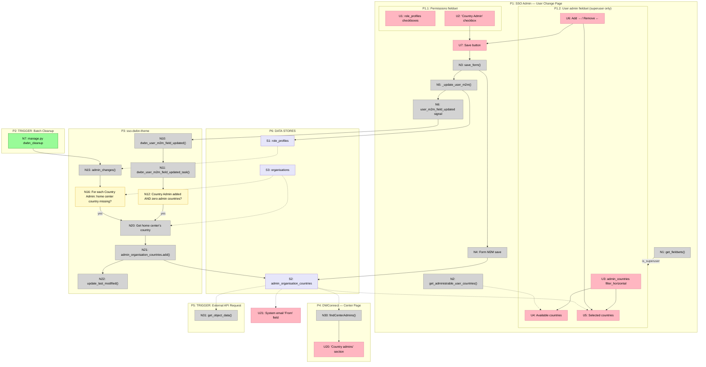

# Breadboarding Worked Example: Mapping an Existing System

A worked reference showing how to breadboard an existing system to trace how a single data store is modified and read across multiple entry points.

This is a worked reference for the breadboarding skill. See SKILL.md for the canonical
table format and concepts.

## Example A: Mapping an Existing System

This example shows breadboarding an existing system to understand how data flows through multiple entry points.

### Input

Workflow to understand: "How is `admin_organisation_countries` modified and read downstream? There are multiple entry points: manual edit, checkbox toggle, and batch job."

### Output

**Places**

| # | Place | Description |
|---|-------|-------------|
| P1 | SSO Admin — User Change Page | Django admin page where a user's roles and admin countries are edited |
| P1.1 | Permissions fieldset | Role/permission checkboxes within the SSO Admin page |
| P1.2 | User admin fieldset (superuser only) | filter_horizontal for admin countries, superuser-gated |
| P2 | TRIGGER: Batch Cleanup | Scheduled CLI entry point that reconciles admin countries |
| P3 | sso-dwbn-theme | Theme package handling signal/task logic and country reconciliation |
| P4 | DWConnect — Center Page | Downstream center page that reads country admins |
| P5 | TRIGGER: External API Request | External API entry point reading user object data |
| P6 | Data Stores | Persistent M2M and organisation records |

**UI Affordances**

| # | Place | Component | Affordance | Control | Wires Out | Returns To |
|---|-------|-----------|------------|---------|-----------|------------|
| U1 | P1.1 | SSO Admin | `role_profiles` checkboxes | render | — | — |
| U2 | P1.1 | SSO Admin | "Country Admin" checkbox | click | toggles selection | — |
| U3 | P1.2 | SSO Admin | `admin_countries` filter_horizontal | render | — | — |
| U4 | P1.2 | SSO Admin | Available countries list | render | — | — |
| U5 | P1.2 | SSO Admin | Selected countries list | render | — | — |
| U6 | P1.2 | SSO Admin | Add → / Remove ← | click | modifies selection | — |
| U7 | P1 | SSO Admin | Save button | click | → N3 | — |
| U20 | P4 | DWConnect | "Country admins" section | render | — | — |
| U21 | P5 | (unknown) | System email "From" field | render | — | — |

**Code Affordances**

| # | Place | Component | Affordance | Control | Wires Out | Returns To |
|---|-------|-----------|------------|---------|-----------|------------|
| N1 | P1 | sso/accounts/admin | `get_fieldsets()` | call | → U3 (conditional) | — |
| N2 | P1 | sso/accounts/models | `get_administrable_user_countries()` | call | — | → U4 |
| N3 | P1 | sso/accounts/admin | `save_form()` | call | → N4, → N5 | — |
| N4 | P1 | Django Admin | Form M2M save | call | → S2 | — |
| N5 | P1 | sso/forms/mixins | `_update_user_m2m()` | call | → S1, → N6 | — |
| N6 | P1 | sso/signals | `user_m2m_field_updated` signal | signal | → N10 | — |
| N7 | P2 | CLI/Scheduler | `manage.py dwbn_cleanup` | invoke | → N15 | — |
| N10 | P3 | sso-dwbn-theme | `dwbn_user_m2m_field_updated()` | receive | → N11 | — |
| N11 | P3 | sso-dwbn-theme | `dwbn_user_m2m_field_updated_task()` | call | → N12 | — |
| N12 | P3 | sso-dwbn-theme | Country Admin added AND zero admin countries? | conditional | → N20 | — |
| N15 | P3 | sso-dwbn-theme | `admin_changes()` | call | → N16 | — |
| N16 | P3 | sso-dwbn-theme | For each Country Admin: home center country missing? | loop | → N20 | — |
| N20 | P3 | sso-dwbn-theme | Get home center's country | call | → N21 | — |
| N21 | P3 | sso-dwbn-theme | `admin_organisation_countries.add()` | call | → S2 | — |
| N22 | P3 | sso-dwbn-theme | `update_last_modified()` | call | — | — |
| N30 | P4 | dwconnect2-backend | `findCenterAdmins()` | call | — | → U20 |
| N31 | P5 | sso/api | `get_object_data()` | call | — | → external |

**Data Stores**

| # | Place | Store | Description |
|---|-------|-------|-------------|
| S1 | P6 | `role_profiles` | M2M: which role profiles a user has |
| S2 | P6 | `admin_organisation_countries` | M2M: which countries a user administers |
| S3 | P6 | `organisations` | User's home center(s) |

**Mermaid Diagram**

---
