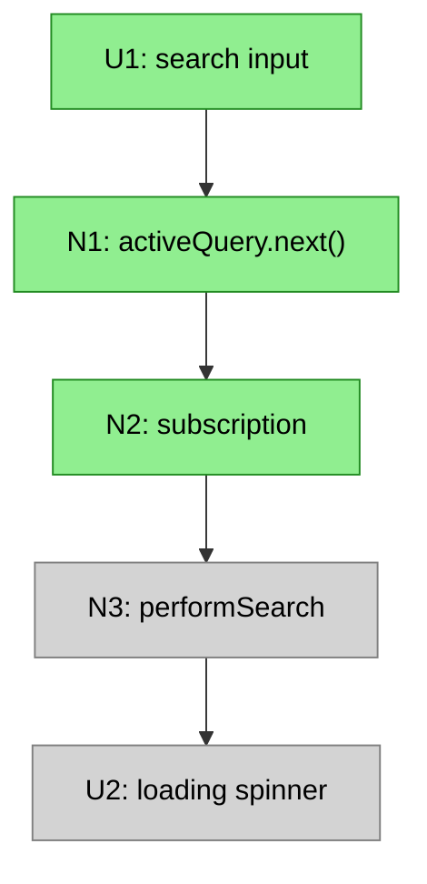
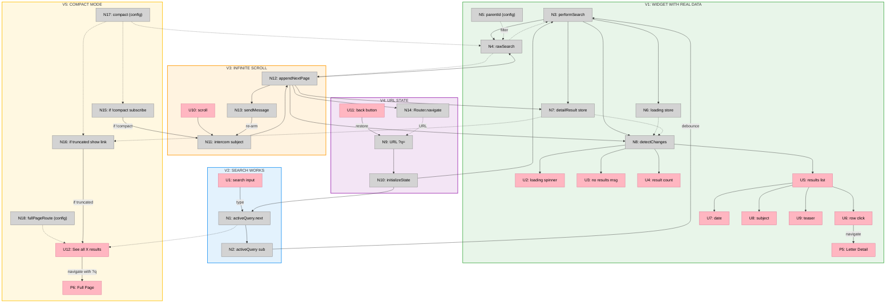

# Slicing a Breadboard

Slicing takes a breadboard and groups its affordances into **vertical implementation slices**. Each slice is a thin cut through all layers — UI, logic, data — that delivers something you can demo. The breadboard shows the complete system; slicing decides the order you build it in.

This is a distinct step from breadboarding. Breadboard first (use the `breadboarding` skill) — you can't slice what isn't mapped. When the breadboard is accurate and wired, slice it.

**Input:**
- Breadboard (affordance tables with wiring)
- Shape (R + mechanisms) — guides which demos matter

**Output:**
- The breadboard's affordances assigned to slices V1–V9 (aim for ≤9)

---

## What is a Vertical Slice?

A vertical slice is a group of UI and Code affordances that together do something **demo-able**. It cuts through all layers — UI, logic, data — to deliver a working increment.

The opposite is a horizontal slice — work confined to one layer (e.g., "set up all the data models") that isn't clickable from the interface. Horizontal layers feel like progress but can't be shown working, so they hide risk.

### The Key Constraint

**Every slice must have visible UI that can be demoed.** A slice without UI is a horizontal layer, not a vertical slice.

- ✅ "Self-serve Signing Path" (demo: checkout → sign → see signature)
- ❌ "Database Schema" (no demo possible)

**Demo-able means:**
- Has an entry point (a UI interaction or trigger)
- Has an observable output (UI renders, an effect occurs)
- Shows meaningful progress toward the R

The shape guides what counts as "meaningful progress" — you're not grouping affordances arbitrarily, you're grouping them to demonstrate mechanisms working.

### Slice Size

- **Too small:** only 1–2 UI affordances, no meaningful demo → merge with a related slice
- **Too big:** 15+ affordances or multiple unrelated journeys → split
- **Right size:** a coherent journey with a clear "watch me do this" demo

Aim for **≤9 slices**. If you need more, combine related mechanisms — features that don't make sense alone belong in the same slice. Consistently needing more than nine is a signal the shape may be too large for one cycle, which is worth surfacing rather than papering over.

### Wires to Future Slices

A slice may contain affordances whose Wires Out point to affordances in *later* slices. Those wires exist in the breadboard but aren't implemented yet — they're stubs or no-ops until that later slice is built.

This is expected. The breadboard shows the complete system; slicing shows the order of implementation. Don't try to eliminate forward wires — just be clear which slice actually implements each target.

---

## Procedure

### Step 1: Identify the minimal demo-able increment

Look at your breadboard and shape and ask: "What's the smallest subset that demonstrates the core mechanism working?" Usually that's the core data fetch + basic rendering — no search, pagination, or state persistence yet. This becomes **V1**.

### Step 2: Layer additional capabilities as slices

Each subsequent slice should demonstrate one mechanism from the shape working:
- V2: Search input (demonstrates the search mechanism)
- V3: Pagination / infinite scroll (demonstrates the pagination mechanism)
- V4: URL state persistence (demonstrates the state-preservation mechanism)

If you exceed nine, combine related mechanisms rather than splitting hairs.

### Step 3: Assign affordances to slices

Go through every affordance and assign it to the slice where it's **first needed** to demo that slice's mechanism. Some affordances will have Wires Out to later slices — that's fine; they're implemented in their assigned slice, and the forward wires just don't do anything yet.

| Slice | Mechanism | Affordances |
|-------|-----------|-------------|
| V1 | Core display | U2, U3, N3, N4, N5, N6, N7 |
| V2 | Search | U1, N1, N2 |
| V3 | Pagination | U10, N11, N12, N13 |

### Step 4: Create per-slice affordance tables

For each slice, extract just the affordances being added. These follow the same column format as the breadboard's affordance tables (see the `breadboarding` skill), scoped to the slice:

**V2: Search Works**

| # | Place | Component | Affordance | Control | Wires Out | Returns To |
|---|-------|-----------|------------|---------|-----------|------------|
| U1 | P1 | search-detail | search input | type | → N1 | — |
| N1 | P1 | search-detail | `activeQuery.next()` | call | → N2 | — |
| N2 | P1 | search-detail | `activeQuery` subscription | observe | → N3 | — |

### Step 5: Write a demo statement for each slice

Each slice needs a concrete demo that shows its mechanism working toward the R — something you could show a stakeholder:
- V1: "Widget shows real data from the API"
- V2: "Type 'dharma', results filter live"
- V3: "Scroll down, more items load"

---

## Visualizing Slices in Mermaid

Show the complete breadboard in every slice diagram, but use styling to distinguish scope — so a stakeholder can see what's being built now, what already exists, and what's still to come:

| Category | Style | Description |
|----------|-------|-------------|
| **This slice** | Bright color | Affordances being added now |
| **Already built** | Solid grey | Previous slices |
| **Future** | Transparent, dashed border | Not yet built |

## Slice Summary Format

| # | Slice | Mechanism | Demo |
|---|-------|-----------|------|
| V1 | Widget with real data | F1, F4, F6 | "Widget shows letters from API" |
| V2 | Search works | F3 | "Type to filter results" |
| V3 | Infinite scroll | F5 | "Scroll down, more load" |
| V4 | URL state | F2 | "Refresh preserves search" |

The Mechanism column references parts from the shape, showing which mechanisms each slice demonstrates.

---

## Worked Example

This continues the breadboard from the `breadboarding` skill's "designing from shaped parts" worked example — a `letter-browser` search widget. With the full breadboard complete, it slices into five vertical increments, each demonstrating one mechanism working.

**Slice Summary**

| # | Slice | Mechanism | Affordances | Demo |
|---|-------|-----------|-------------|------|
| V1 | Widget with real data | F1, F4, F6 | U2-U9, N3-N8, P5 | "Widget shows real data" |
| V2 | Search works | F3 | U1, N1, N2 | "Type 'dharma', results filter" |
| V3 | Infinite scroll | F5 | U10, N11-N13 | "Scroll down, more load" |
| V4 | URL state | F2 | U11, N9, N10, N14 | "Refresh preserves search" |
| V5 | Compact mode | — | U12, N15-N18, P6 | "Shows 'See all' link" |

**Slice Diagram**

Notice V1 already contains the forward wires into later slices (the search and scroll paths exist in the breadboard) — they're stubs until V2 and V3 implement them. That's the expected shape of a sliced breadboard.

---

## Document Output

Slicing produces the **Slices doc** — slice definitions, per-slice affordance tables, and the sliced breadboard — and feeds individual **slice plans** (V1-plan.md, V2-plan.md, …). See the `shaping` skill for how these documents relate and how to keep them in sync. Give the Slices doc `shaping: true` frontmatter so the ripple-check hook keeps it consistent with the breadboard and shaping doc above it.
